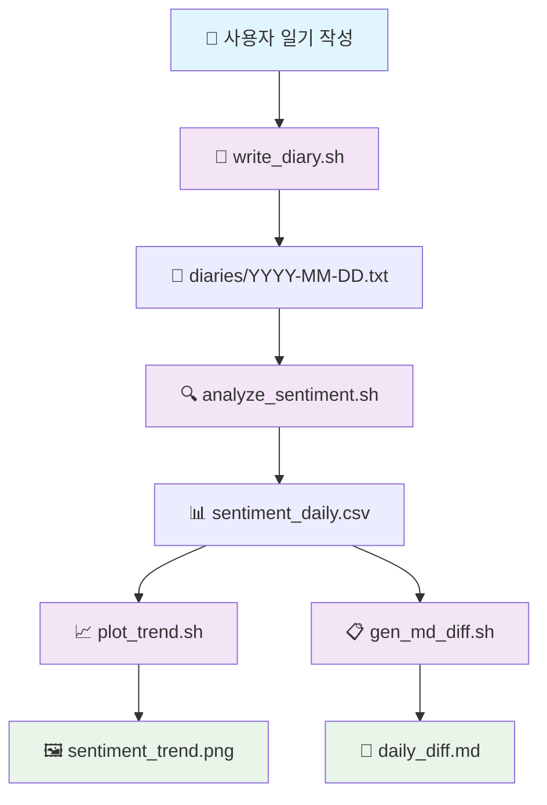

  

  
## 하루의 감정을 기록하고, 나의 마음 상태를 되돌아보세요 :)
하루 동안 느낀 감정을 간단히 기록하고 시각화하여 나의 마음 변화를 한눈에 확인할 수 있습니다.<br>
자신의 감정 패턴을 돌아보며 자기 이해와 정서 관리를 돕는 개인 맞춤형 기록을 제공합니다.

---

## 👥 구성원
<table>
  <tr>
    <td align="center">
      <a href="https://github.com/Minkyoungg0">
        <br />
        <sub><b>문민경</b></sub>
      </a>
    </td>
    <td align="center">
       <a href="https://github.com/GodNowoon">
        <br />
        <sub><b>이노운</b></sub>
      </a>
    </td>
    <td align="center">
      <a href="https://github.com/songhajang">
        <br />
        <sub><b>장송하</b></sub>
      </a>
    </td>
    <td align="center">
      <a href="https://github.com/Gill010147">
        <br />
        <sub><b>황병길</b></sub>
      </a>
    </td>
  </tr>
</table>

## 📝 프로젝트 목표
**일일 감정 기록**: 사용자가 하루 동안 느낀 감정을 쉽고 빠르게 기록할 수 있도록 합니다. <br>
**마음 상태 시각화**: 기록된 감정을 차트나 그래프 형태로 시각화하여 나의 감정 패턴을 한눈에 파악하게 합니다.


## 📁 파일 구조
```
emotion-diff
├── diaries/                  # 일기 원본 텍스트 (날짜별 파일 저장)
│   ├── 2025-09-08.txt
│   ├── 2025-09-09.txt
│   └── 2025-09-10.txt
│
├── lexicon/                  # 감정 분석 사전
│   ├── positive_ko.txt       # 긍정 단어 리스트
│   └── negative_ko.txt       # 부정 단어 리스트
│
├── output/
│   ├── reports/              # 분석 결과물
│   │   ├── sentiment_daily.csv   # 날짜별 감정 점수 집계 (CSV)
│   │   ├── summary_latest.txt    # 최신 일자의 요약 결과
│   │   └── daily_diff.md         # 전일 ↔ 금일 감정 점수 비교 (diff 스타일 Markdown)
│   │
│   └── charts/ (optional)    # 감정 추이 그래프 (gnuplot 사용시 생성)
│       └── sentiment_trend.png
│
└── scripts/                  # 실행 스크립트 모음
    ├── write_diary.sh        # 일기 작성 → diaries/YYYY-MM-DD.txt 생성
    ├── analyze_sentiment.sh  # 모든 일기 분석 → sentiment_daily.csv/summary_latest.txt 갱신
    ├── plot_trend.sh         # CSV 기반 감정 추이 그래프 생성 → charts/sentiment_trend.png
    └── gen_md_diff.sh        # 전일 ↔ 금일 감정 점수 비교 → daily_diff.md (diff 명령어 활용)

```

## ⚙️ 시스템 아키텍처



---

## ⚙ 사용 기술 및 도구 (Tech Stack & Tools)

> **IDE / OS**: VS Code / Ubuntu 24.04 / diff 3.10 <br>
> **가상 환경**: VirtualBox (Linux VM 구동) <br>
> **버전 관리**: Git / GitHub <br>
> **협업**: Notion / Slack <br>

---

## 📝 이론 설명

### 📌 .sh 파일이란?
.sh 파일은 리눅스나 유닉스 환경에서 실행되는 스크립트 파일입니다.
주로 쉘(Shell) 명령어를 순서대로 작성해서 반복 작업을 자동화하는 데 사용됩니다.

공동 작업 환경에서 파일 및 디렉토리 접근 권한을 안전하게 제어하기 위한 **그룹 생성 → 사용자 추가 → 권한 설정** 절차입니다.  

### 실행과정

#### 1. 그룹 생성

작업 전용 그룹을 생성합니다.  
예시: `devgroup`

```bash
sudo groupadd devgroup
```

#### 2. 사용자 그룹 추가

협업 대상 사용자를 새 그룹에 등록합니다.

```
sudo usermod -aG devgroup user01
sudo usermod -aG devgroup ubuntu
```

> -aG: 기존 그룹 유지 + 새 그룹 추가
> 변경 사항은 로그아웃/로그인 후 적용됩니다.

#### 3. 파일 그룹 변경

대상 파일의 소유 그룹을 새 그룹으로 변경합니다.

```
sudo chgrp devgroup test.sh
```

#### 4. 그룹 권한 설정

> 소유자와 그룹에만 접근 권한을 부여합니다.

```
chmod 770 test.sh
```

> Owner (user01): rwx → 읽기/쓰기/실행
> Group (devgroup): rwx → 읽기/쓰기/실행
> Others: --- → 접근 불가

#### 5. 디렉토리 접근 권한 조정

파일 접근을 위해 상위 디렉토리에도 실행 권한을 부여해야 합니다.

```
sudo chgrp devgroup /home/user01
chmod 750 /home/user01
```
> r_x → 읽기/실행 권한 부여

---

### 📌 diff란?

`diff`는 두 파일을 비교해서 **무엇이 달라졌는지**, **추가/삭제된 내용**을 알려주는 Linux 명령어입니다.

- `-` : 첫 번째 파일에서 삭제된 내용
- `+` : 두 번째 파일에 새로 추가된 내용

기본적으로 줄 단위로 비교되며, 옵션에 따라 단어 단위 비교도 가능합니다.


### 주요 사용 명령어

#### 1. 기본 비교
```bash
diff file1.txt file2.txt
```

> 두 파일의 차이점 전체를 줄 단위로 보여줍니다

#### 2. 간략 비교 (다른지 여부만 확인)

```bash
diff -q file1.txt file2.txt
```

> 출력: "Files are identical" 또는 "Files are different"

#### 3. 통합(diff unified) 형식

```bash
diff -u file1.txt file2.txt
```

> 변경 부분의 위/아래 문맥을 포함합니다
> Git diff와 유사한 출력 형식


#### 4. 단어 단위 비교 (추가 설치 필요)

```bash
sudo apt install wdiff
wdiff file1.txt file2.txt
```

> 단어별 추가/삭제를 강조 표시

#### 5. 결과를 파일로 저장

```bash
diff file1.txt file2.txt > diff_result.txt
```

> 나중에 분석이나 시각화에 활용 가능

---

## 📋 구현과정

```bash
# 필수 패키지 설치
sudo apt-get update

# diff (일반적으로 기본 설치되어 있음, 그래도 재설치 가능)
sudo apt install diffutils -y

# gnuplot (그래프 시각화용)
sudo apt install gnuplot -y
```

### 💾 데이터 셋
감정 어휘 사전 준비가 필요합니다.
```bash

cat > lexicon/positive_ko.txt << EOF
좋다
행복
기쁘다
여유
감사
만족
EOF

cat > lexicon/negative_ko.txt << EOF
싫다
짜증
화가난다
우울
불안
스트레스
EOF
```

### 🔄 자동화 설정

**crontab 등록 예시:**
```bash
# crontab -e
# 매일 22:30 자동 분석
30 22 * * * cd ~/EmotionDelta && ./scripts/analyze_sentiment.sh && ./scripts/gen_md_diff.sh && ./scripts/plot_trend.sh
```
---

## 🚀 실행 과정

### ✍️ 첫 번째 일기 작성

```bash
# 오늘 날짜로 일기 작성
./scripts/write_diary.sh

# 특정 날짜로 일기 작성
./scripts/write_diary.sh --date 2025-09-10

# 표준 입력으로 일기 작성
echo "오늘은 정말 좋은 하루였다. 친구들과 만나서 즐거웠고 기분이 좋았다." | ./scripts/write_diary.sh --stdin
```

### 📊 분석 실행

```bash
# 전체 분석 파이프라인 실행
./scripts/analyze_sentiment.sh    # 감정 분석
./scripts/gen_md_diff.sh          # 비교 리포트 생성
./scripts/plot_trend.sh           # 그래프 생성

# 결과 확인
ls output/reports/                # CSV 및 마크다운 리포트
ls output/charts/                 # PNG 그래프
```

---

## 📊 사용 예시

### 💡 일기 작성 예시

**2025-09-10.txt**
```
칼퇴 후 이 좋다 싫다 싫다 싫다
친구와 만나서 즐거웠지만 일이 스트레스였다
```

### 📈 분석 결과

**sentiment_daily.csv**
```csv
date,pos,neg,net
2025-09-08,1,1,0
2025-09-09,1,0,1
2025-09-10,2,4,-2
```

**daily_diff.md**
```markdown
# 감정 변화 분석 리포트

## 📅 2025-09-10 vs 2025-09-09

| 지표 | 어제 | 오늘 | 변화 |
|------|------|------|------|
| 긍정 점수 | 1 | 2 | ↑ +1 |
| 부정 점수 | 0 | 4 | ↑ +4 |
| 순 점수 | 1 | -2 | ↓ -3 |

### 💬 분석 코멘트
부정 감정이 크게 증가하여 순 감정 점수가 하락했습니다.
```

---

## 🐛 트러블슈팅

<details>
<summary><strong>📌 문제와 해결책</strong></summary>

#### ❌ 문제: 단어 부분 일치로 오탐 발생
**예시:** '슬프다' 검색 시 '고슬프다'도 카운트
```bash
# 해결: grep -w 옵션 사용
grep -w "슬프다" diary.txt
```

#### ❌ 문제: 한글 인코딩 깨짐
```bash
# 해결: 환경 변수 설정
export LANG=ko_KR.UTF-8
export LC_ALL=ko_KR.UTF-8
```

#### ❌ 문제: gnuplot 명령어 찾을 수 없음
```bash
# 해결: 패키지 설치
sudo apt-get install gnuplot
```

#### ❌ 문제: 권한 거부 오류
```bash
# 해결: 실행 권한 부여
chmod +x scripts/*.sh
```
</details>

---

## 📂 회고

### 👤 문민경
이번 프로젝트를 통해 **표준 입출력과 파이프를 활용한 쉘 스크립트의 강력함**을 체감할 수 있었습니다. 특히, 여러 명령어를 조합하여 복잡한 텍스트 처리 파이프라인을 구축하는 과정이 흥미로웠습니다. 앞으로는 더 복잡한 자동화 시스템도 구축해보고 싶습니다.

### 👤 이노운  
팀원들과 **Git을 사용하여 협업하며 코드 충돌을 해결하고, 의미 있는 커밋 메시지를 작성하는 습관**의 중요성을 깨달았습니다. 특히 브랜치 전략과 코드 리뷰 과정에서 많은 것을 배웠고, 협업 개발의 진정한 가치를 이해할 수 있었습니다.

### 👤 장송하
초기에는 텍스트 분석 로직을 어떻게 구현할지 막막했지만, **grep과 같은 기본 도구의 다양한 옵션을 깊이 있게 학습하며 문제를 해결**할 수 있었습니다. 단순해 보이는 유닉스 명령어들도 조합하면 놀라운 일들을 할 수 있다는 것을 깨달았습니다.

### 👤 황병길
**gnuplot이라는 새로운 시각화 도구를 사용해 보는 경험**이 신선했습니다. 데이터를 효과적으로 시각화하는 것의 중요성과 스크립트를 통해 이를 자동화하는 방법을 배울 수 있었습니다. 앞으로는 더 다양한 시각화 라이브러리도 경험해보고 싶습니다.

---


## 🚀 향후 확장 계획

- 웹 인터페이스 도입
- 다차원 감정 분류로 고도화된 감정 분석
- 자동 백업 및 동기화를 통한 클라우드 통합
